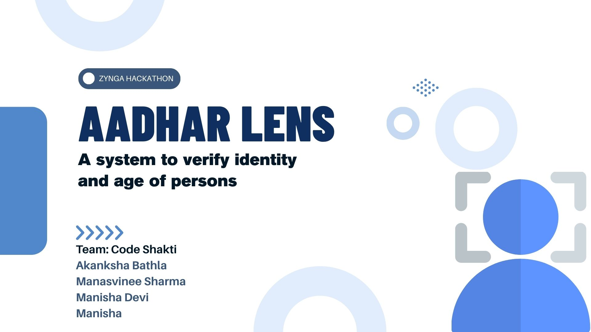
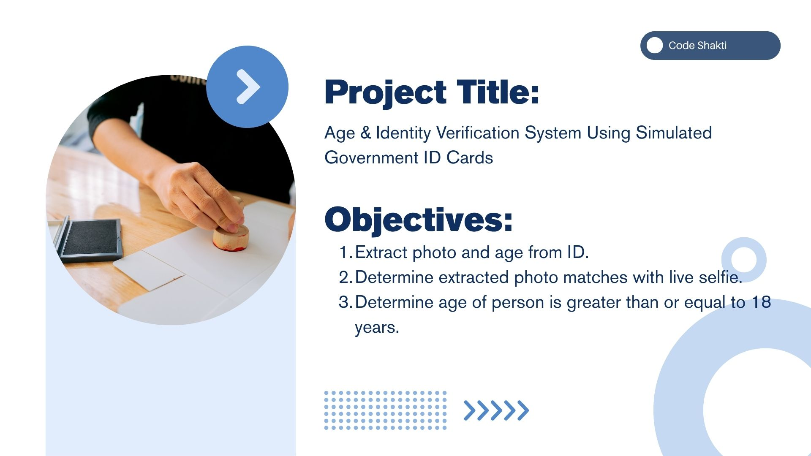
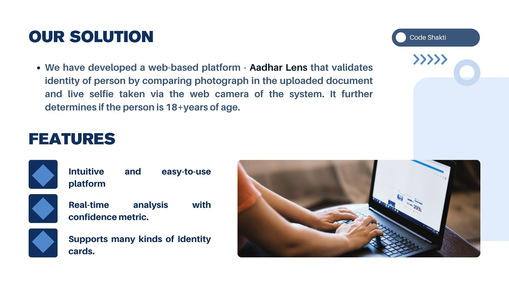
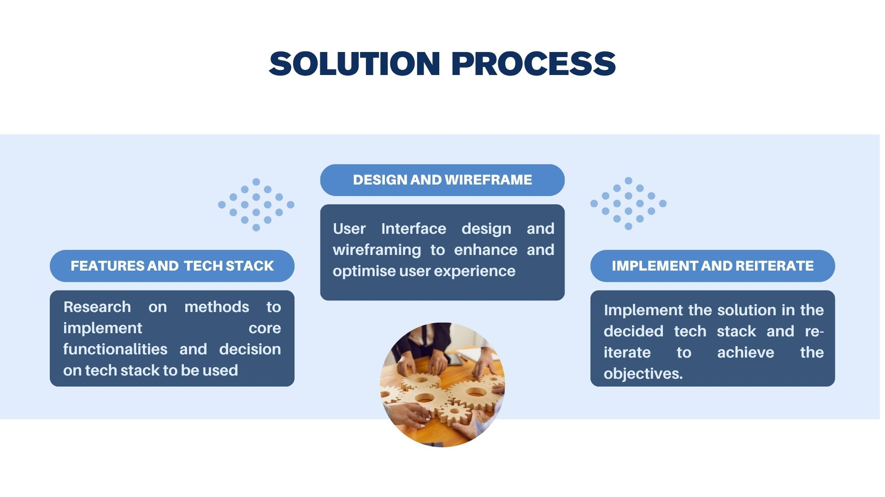
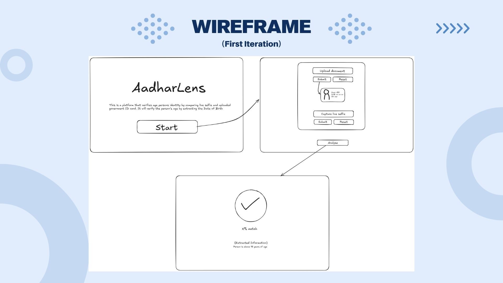
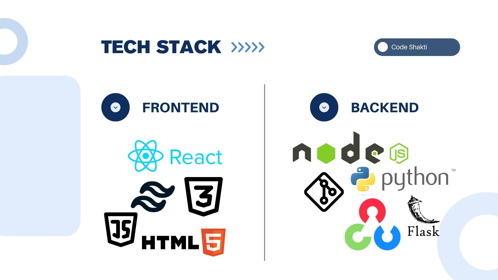
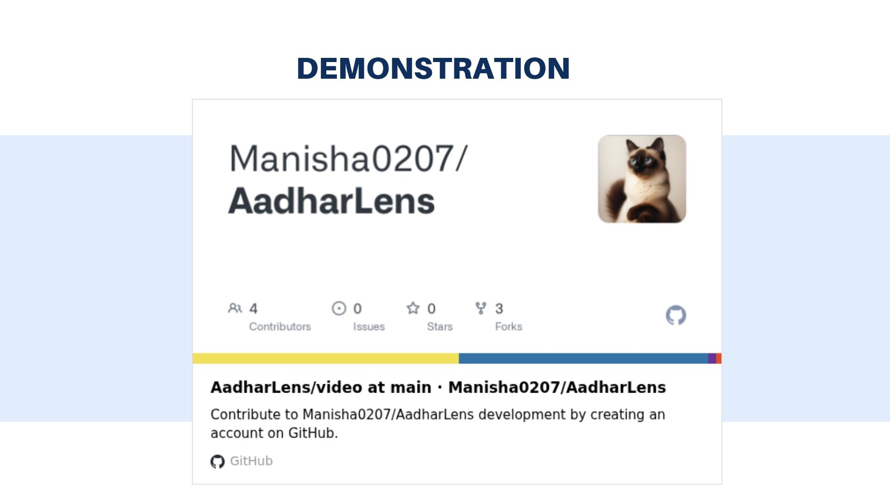
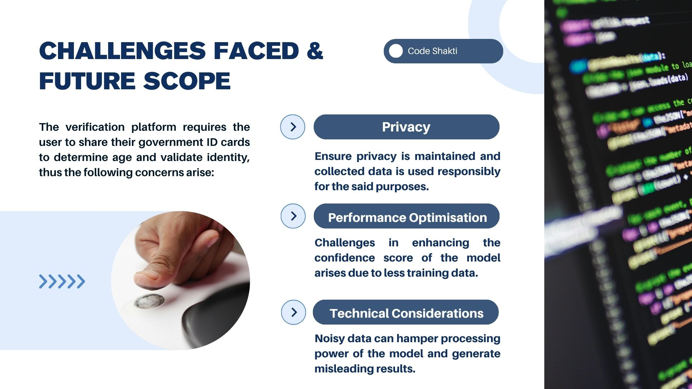
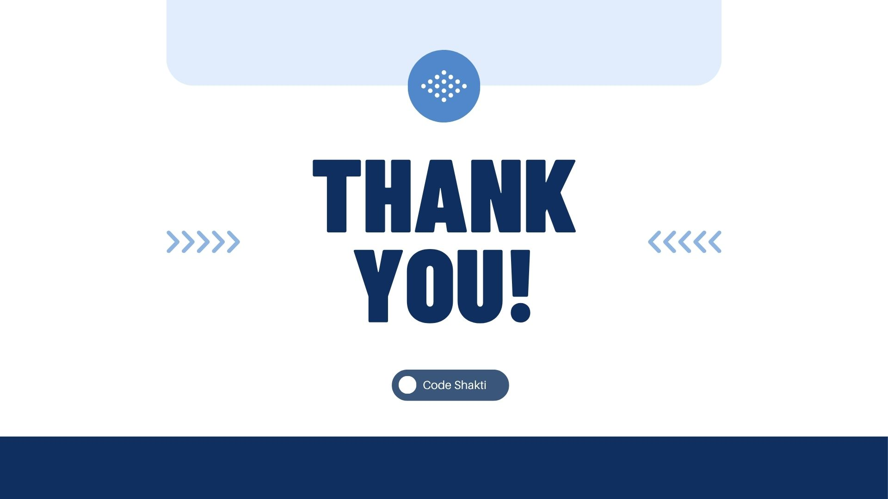

# 🔍Aadhar Lens

A proof-of-concept web application that verifies a person's identity and age using a simulated Aadhaar card and a live selfie. It uses OCR to extract the date of birth and performs face recognition to verify if the person holding the Aadhaar is the same as the one in the selfie. The system also displays a confidence score for the face match and determines if the person is eligible to vote (18+).


## 📚 Table of Contents
- [📌 Problem Statement](#-problem-statement)
- [🚀 Features](#-features)
- [📂 Project Structure](#-project-structure)
- [⚙️ Tech Stack](#%EF%B8%8F-tech-stack)
- [📥 Installation & Setup](#-installation--setup)
  - [🔧 Backend](#-backend-1)
  - [🌐 Frontend](#-frontend)
- [🧪 How It Works](#-how-it-works)
- [📽️ Demo Video](#%EF%B8%8F-demo-video)
- [📊 Presentation Slides](#-presentation-ppt)
- [💾 Executable (.exe) File](#-executable-exe-file)
- [🔒 Security Notes](#-security-notes)
- [🎁 Bonus Features](#-bonus-features)
- [🙏 Acknowledgements](#-acknowledgements)
- [📬 Contact](#-contact)


## 📌 Problem Statement

Design a system that:
- Extracts age and face from a simulated Aadhaar card (PDF or image).
- Compares the Aadhaar photo with a live selfie.
- Determines whether:
  - The Aadhaar and selfie belong to the same individual.
  - The person is 18+ and eligible to vote.

> ⚠️ This is a simulated system using fake/sample Aadhaar data. No real government APIs or UIDAI data are accessed.


## 🚀 Features

- 🧾 Upload Aadhaar image or PDF.
- 🤳 Capture a live selfie using your webcam.
- 🧠 OCR-based DOB extraction and age calculation.
- ✅ Face recognition using OpenCV's Haarcascade + LBPH algorithm.
- 📊 Confidence score for face match.
- ✅ Voting eligibility check (18+ verification).
- 🎨 Clean and user-friendly web interface built with React.js.


## 📂 Project Structure

```
├── Backend/
│ ├── dataset/
│ ├── uploads/ # Temp directory for Aadhaar/selfie files
│ ├── app.py # Flask backend API
│ ├── face_match.py # LBPH face recognition logic
│ ├── face_cropper.py # Haarcascade-based face detection and cropping
│ ├── ocr_utils.py # DOB extraction using OCR
│ ├── model_utils.py
│ ├── label_map.pkl # Label map for LBPH recognizer
│ ├── face_model.xml # Trained LBPH face recognizer model
│ ├── quality_utils.py
│ ├── selfie_capture_recog.py
│ ├── train_model.py
│ └── requirements.txt
│
├── Frontend/
│ ├── src/
│ │ ├── components/
│ │ │ ├──About.jsx
│ │ │ ├──Footer.jsx
│ │ │ ├──Hero.jsx
│ │ │ ├──HowItworks
│ │ │ ├──navbar.jsx
│ │ │ ├── SelfieCapture.jsx
│ │ │ ├── VerificationPage.jsx
│ │ │ └── PhotoUpload.jsx
│ │ └── App.js
│ │ └── main.jsx
│ └── package.json
│
├── README.md
└── .gitignore
```


## ⚙️ Tech Stack

### 🔧 Backend
- Python (Flask)
- OpenCV (`cv2.face.LBPHFaceRecognizer`)
- Haarcascade for face detection
- PyTesseract for OCR

### 🌐 Frontend
- React.js
- HTML/CSS (Tailwind + basic styling)
- `react-toastify` for notifications
- Webcam file input support


## 📥 Installation & Setup

### 🔧 Backend

```bash

cd backend
python -m venv venv
source venv/bin/activate  # or venv\Scripts\activate on Windows
pip install -r requirements.txt
python app.py

```

Flask will run at `http://localhost:5000`

### 🌐 Frontend

```bash 
cd frontend
npm install
npm run dev  
```

React app will run at `http://localhost:5173` 


## 🧪 How It Works

1. **User uploads Aadhaar card** (PDF or image).
2. **User takes a selfie** using webcam or file.
3. Backend:
   - Extracts and crops face from both images using Haarcascade.
   - Compares Aadhaar and selfie faces using LBPH recognizer.
   - Uses OCR to extract DOB and calculate age.
4. **Frontend displays:**
   - ✅ Face match result.
   - 📊 Confidence score.
   - 🎂 DOB and age.
   - 🗳️ Eligibility to vote (18+ or not).


## 📽️ Demo Video
Watch the full working demo here:
➡️ Demo Video on Google Drive / YouTube

### 🎥 Walkthrough includes:

- Uploading Aadhaar (PDF/Image)
- Capturing a live selfie
- OCR extraction and age check
- Face match result + confidence score
- UI flow and result summary

## 📊 Presentation (PPT)
View the detailed presentation here: 
[➡️ Project PPT](https://www.canva.com/design/DAGrSMIaCig/mZpXw3j_4YmnYQ8Hlo3jvw/edit?utm_content=DAGrSMIaCig&utm_campaign=designshare&utm_medium=link2&utm_source=sharebutton)

<div style="display: flex; overflow-x: auto; gap: 10px; padding: 10px 0;">
  
  
  
  
  
  
  
  
  
</div>

## 📋 Includes:

- Problem statement & objectives
- Architecture diagram
- Tech stack
- OCR + Face recognition flow
- Screenshots of UI
- Challenges & future scope

## 💾 Executable (.exe) File
You can run the application without setting up the environment by downloading the prebuilt executable:

➡️ Download Executable (.exe)

### ⚙️ How to use:

- Download and unzip the `.exe` file.
- Double-click to run the app locally (ensure camera access is enabled).
- No setup required!

📝 Note: The `.exe` runs only the backend. Use the frontend in browser at `http://localhost:5173`.


## 🔒 Security Notes
- No real Aadhaar data is used — only samples.
- All file processing happens locally.
- Files stored in `uploads/` are temporary; configure auto-cleaning in production.
- Use HTTPS and encryption in real deployments.

## 🎁 Bonus Features
 - Confidence score for face match
 - Age eligibility check
 - Feedback for blurry or low-light selfies
 - OCR support for regional Aadhaar cards (Hindi, Tamil, etc.)
 - Auto-cleaning of temporary files


<!-- ## 📄 License
This project is licensed under the MIT License. -->

## 🙏 Acknowledgements
- OpenCV
- PyTesseract
- React.js
- Aadhaar sample documents for testing (only simulated data used)

## 📬 Contact
If you have any questions or feedback, feel free to reach out via GitHub Issues or email.

